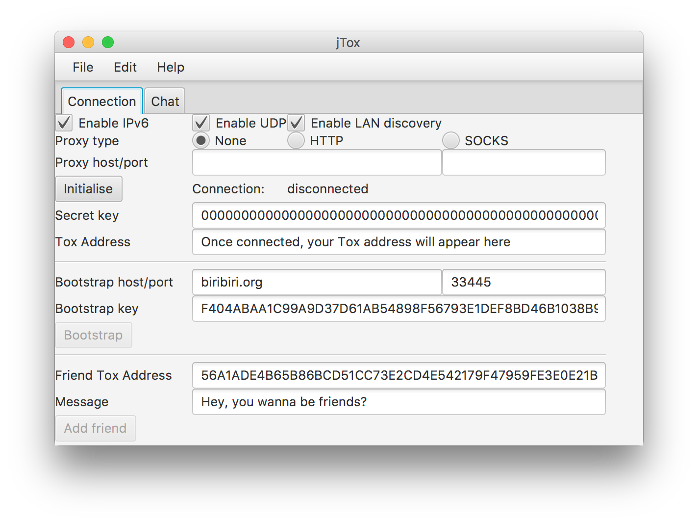

# Java Tox client

This is a simple test client for tox4j.

## Contributing

We're using the standard Github workflow for our code reviews. Just open Pull
Requests and the reviewer will guide you through the process.

# Building jTox

## Dependencies: compile

To build the package itself, the following dependencies are required:

- com.chuusai:shapeless_2.11:2.3.2
- com.google.code.findbugs:jsr305:3.0.0
- com.google.guava:guava:19.0
- com.google.protobuf:protobuf-java:3.5.0
- com.intellij:annotations:12.0
- com.lihaoyi:fastparse-utils_2.11:0.3.7
- com.lihaoyi:fastparse_2.11:0.3.7
- com.lihaoyi:sourcecode_2.11:0.1.1
- com.trueaccord.lenses:lenses_2.11:0.4.7
- com.trueaccord.scalapb:scalapb-runtime-grpc_2.11:0.5.43
- com.trueaccord.scalapb:scalapb-runtime_2.11:0.5.43
- com.typesafe.scala-logging:scala-logging_2.11:3.7.2
- io.grpc:grpc-context:1.0.1
- io.grpc:grpc-core:1.0.1
- io.grpc:grpc-stub:1.0.1
- org.scala-lang.modules:scala-java8-compat_2.11:0.7.0
- org.scala-lang.modules:scala-parser-combinators_2.11:1.0.4
- org.scala-lang.modules:scala-xml_2.11:1.0.5
- org.scala-lang:scala-compiler:2.11.12
- org.scala-lang:scala-reflect:2.11.12
- org.scalaz:scalaz-core_2.11:7.3.0-M18
- org.scodec:scodec-bits_2.11:1.1.2
- org.scodec:scodec-core_2.11:1.10.3
- org.slf4j:slf4j-api:1.7.25
- org.toktok:jtox_2.11:0.1.0
- org.toktok:macros_2.11:0.1.0
- org.toktok:tox4j-api_2.11:0.1.3
- org.toktok:tox4j-c_2.11:0.1.3-SNAPSHOT
- org.typelevel:macro-compat_2.11:1.1.1

## Dependencies: test

For testing, the following additional dependencies are required:

## C/C++ dependencies

### Native code

* Toxcore
* Toxav
  * We require the latest git version of these libraries, so you will need to build them yourself.
* CMake (>= 2.8.7)
  * Debian/Ubuntu: cmake
* protobuf 3.0.0
  * Debian/Ubuntu: You need to build this from source.
* Clang 3.5 or newer (older versions of clang segfault. G++ support is untested, the build script enforces clang-3.5 for now. If you do not have clang 3.5 installed, your build may fail.)
  * Debian/Ubuntu: clang-3.5

## Building

- Build and install toxcore and toxav.
- Run the sbt console with `sbt`.

Now you can use `compile` to build, `test` to run unit tests (these are a lot of
tests with high timeouts, might take 10 minutes or longer), and `package` to
create a jar and the native library.

### Developing on Mac OS X

Getting the required tools for development on OS X is very easy. If you have
XCode installed, you will already be able to compile the C++ part of tox4j,

### Importing in IDEA

To import the project in IDEA, launch IDEA and:

- On the "Welcome to IntelliJ IDEA" screen, select "Import Project".
- Select the directory jvm-toxcore-c (this git repository).
- Press "OK".
- Select "Import project from external model".
- Select "SBT".
- Press "Next".
- Select "Use auto-import", "Download sources and docs", and "Download SBT sources and docs".
- Create and select a JDK if you don't have one, yet.
- Press "Finish".

Now you need to wait while IDEA builds the project info from the SBT project.
When it is done, it shows a list of modules, all are selected. Leave them
selected and press "OK". After IDEA opens, it will say "Unregistered VCS root
detected". Press "Add root" so you can use git from IDEA. If you have the
protobuf extension installed, you can register the proto files with that as
well (another notification will show for that).
